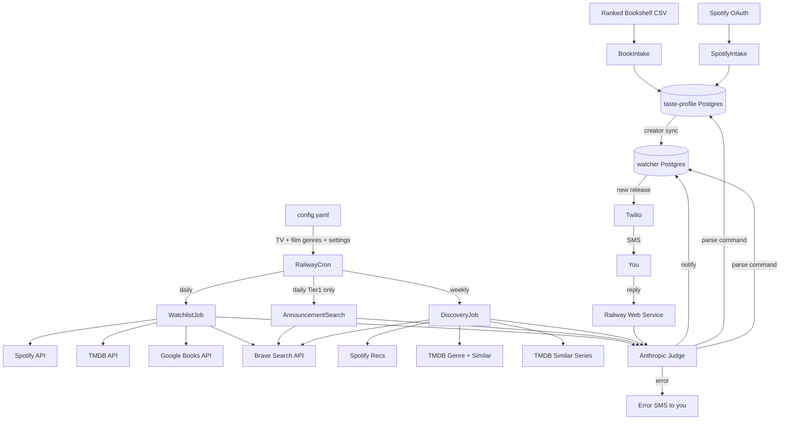

# Release Watcher Agent

## Two Repos, One System

1. `**taste-profile**` — standalone repo + Postgres. Ingests your real data (bookshelf, Spotify). Portable to any future project. No release-watching logic lives here.
2. `**release-watcher**` — the notification agent. Periodically syncs creator data from taste profile into its own local table, then runs scans independently. Does not hardcode any creator data.

## What It Does

- Runs on Railway Cron services (daily watchlist scan, weekly discovery)
- Monitors your explicit watchlist + occasional discovery recs based on taste fit
- Texts you via Twilio with a real article/announcement link (via web search), not just an API page
- Tracks everything it's already told you so it never spams
- Stretch: SMS replies to update scores directly in the taste profile DB

## Notification Rules

- **Tier 1 creators** (score above threshold - defined at setup): Notify on announcement AND release
- **Tier 2 creators** (mid-range scores): Notify on release only
- **Tier 3 / low score:** No proactive notification (still used for discovery scoring)
- **Discovery recs:** Notify on release only; taste fit is the primary signal, not review metrics
- **Music:** Albums for all tiers; singles only for Tier 1 artists
- **TV:** New seasons only (not individual episodes), as specified in config.yaml. TV discovery IS included — TMDB "similar series" seeded from your manually tracked shows.
- **Books:** Novels and novellas; not short story collections or non-fiction from fiction authors unless specified

## Architecture




## Part 1: Taste Profile Repo

### Data Inputs

- **Books:** Ranked series list you provide (CSV or plain text). Authors with multiple series on the list get compounding score. Rank position is the primary weight. Intake script resolves author name → Google Books author ID for the watcher to use.
- **Music:** Spotify user OAuth (scope: `user-top-read`, `user-follow-read`, `user-library-read`, `user-read-recently-played`) → top artists across short/medium/long term windows, followed artists. Time-weighted listen score. Re-run monthly or on demand. The OAuth refresh token is stored in a Railway env var (`SPOTIFY_REFRESH_TOKEN`) so monthly re-syncs run unattended without repeating the browser-based auth flow.
- **Film:** No structured data - qualitative genre/style descriptions captured in `config.yaml` in the release-watcher repo, fed directly to the Anthropic judge as a taste description string.
- **TV:** Manually specified in `config.yaml` with tier assignments.

### Adding Creators Later

New creators not in the original intake can be added two ways:

- Direct DB edit: `INSERT INTO book_authors` or `music_artists` with a manually assigned score
- Stretch: SMS command "add [name]" → webhook looks up the creator via API, assigns a mid-range score, logs to `score_history`

### Tier Thresholds (defined at setup, stored in `profile_metadata`)

Tier assignment is derived from score at sync time, not stored in the taste profile. Thresholds are configured once:

- Tier 1: top N creators by score in each category (e.g. top 10 authors, top 15 artists)
- Tier 2: next N (e.g. next 20)
- Below that: available for discovery scoring but not actively monitored

### Taste Profile Schema

- `book_authors` — id, name, rank_score, series_count, inferred_genres, google_books_id
- `music_artists` — id, name, spotify_id, listen_score, genres
- `score_history` — id, category, creator_id, old_score, new_score, source (sms/manual/spotify_sync/book_intake), note, created_at
- `profile_metadata` — last_spotify_sync, last_book_intake, tier1_book_cutoff, tier1_music_cutoff, tier2_book_cutoff, tier2_music_cutoff, schema_version

`rank_score` and `listen_score` are the single source of truth — updated directly by any input. `score_history` is an audit log for undo/inspection only.

### JSON Export

`export/profile_export.py` dumps the full profile to `taste_profile.json`. Future projects can consume this without a DB connection.

### Key Files

- `intake/books.py` — ranked series list → scored authors
- `intake/spotify.py` — user OAuth flow (first run), then refresh-token re-sync (monthly cron); stores `SPOTIFY_REFRESH_TOKEN` to stdout on first run for you to paste into Railway env vars
- `export/profile_export.py` — DB → `taste_profile.json`
- `models.py` — SQLAlchemy models
- `alembic/` — migrations
- `.env.example` — documents all required env vars including both Spotify app credentials and refresh token
- `README.md` — intake instructions, OAuth setup, how to add creators manually, how to export
- `railway.toml` — Postgres + monthly Spotify re-sync Cron

## Part 2: Release Watcher Repo

### Config YAML (operational settings, TV, and film only)

```yaml
preferences:
  film_taste: >
    # Written in plain language at setup time - used by the Anthropic judge for
    # qualitative taste matching. e.g. "I like slow-burn thrillers, literary drama,
    # and thoughtful sci-fi. I don't enjoy superhero films or broad comedy."
  film_tmdb_genre_ids: [18, 53, 878]
    # TMDB genre IDs for discovery filtering - set once manually at setup.
    # Full list at themoviedb.org/genre/movie/list
    # 18=Drama, 53=Thriller, 878=Sci-Fi etc. Judge still applies taste fit on top.
  quiet_hours:
    start: "22:00"
    end: "08:00"
    timezone: "America/Los_Angeles"   # adjust to your local timezone
    behavior: queue   # "queue" = hold and send at 08:00 | "drop" = discard silently
    max_batch: 3      # if queued notifications > 3, send top 3 by priority and drop rest
  discovery_frequency: weekly
  tier1_announcement_search: true

watchlist:
  tv:
    # Filled in at setup with real shows and tier assignments
    # tier 1 = announce + release, tier 2 = release only
    shows: []
```

No placeholder creator data. All book/music creators come from the taste profile DB. Film TMDB genre IDs are set once manually — they don't need to be re-derived from the free-text `film_taste` string at runtime. The `film_taste` string is only used by the Anthropic judge for qualitative reasoning about individual candidates.

### Creator Sync

A `sync_creators.py` script reads from the taste profile DB, applies tier thresholds from `profile_metadata`, and upserts into the watcher's `tracked_creators` table. The watcher operates entirely from this local copy — no cross-project DB queries during scans.

Sync runs on its own Railway Cron schedule (weekly), not on every daily scan startup. If you update your taste profile scores manually, run `sync_creators.py` on demand to propagate the change.

### Watcher Schema

- `tracked_creators` — id, category, name, tier, external_id (spotify_id / google_books_id / tmdb_id), last_synced_from_profile, profile_score_at_sync
- `releases` — id, tracked_creator_id, external_release_id, title, type, announced_date, release_date, notified_announced_at, notified_released_at, source_url, announcement_hash
- `notification_queue` — id, release_id (nullable), discovery_sent_id (nullable), message_text, queued_at, send_after, priority, sent_at
- `discovery_sent` — id, external_id, category, title, creator_name, sent_at
- `user_overrides` — tracked_creator_id, action (mute/deprioritize), expires_at
- `tier_changes` — id, tracked_creator_id, old_tier, new_tier, changed_at

`tracked_creator_id` is a local watcher FK — no cross-DB reference required. `announcement_hash` is an MD5 of the announcement headline/URL used to deduplicate Tier 1 announcement search results across daily runs. `profile_score_at_sync` records the score when the creator was last synced — used to detect tier changes at next sync. `notification_queue` uses nullable FKs to either `releases` or `discovery_sent` depending on whether the queued message is a watchlist hit or a discovery rec — exactly one should be non-null.

### Data Sources

- **Music releases:** Spotify API with client credentials (public artist album data — no user OAuth needed for this)
- **Music discovery:** Spotify recommendations API requires user auth. The refresh token stored from intake (`SPOTIFY_REFRESH_TOKEN`) is used here to obtain a fresh access token at discovery job runtime. The discovery job calls `/recommendations` with seed artists from the top of the taste profile.
- **TV + Movies:** TMDB API (free; TV on the air, upcoming movies, genre filter for discovery)
- **Books:** Google Books API (search by author ID sorted by newest)
- **Web search:** Brave Search API for article links, announcement detection, and discovery context

### Web Search Layer

Web search fires in three situations:

- **On any watchlist hit:** `"[creator] [title] announcement"` or `"[creator] [title] review"` → best article link for the SMS, context for the judge
- **Daily Tier 1 announcement scan:** `"[creator] new [album/book/season] 2026"` for each Tier 1 creator → catches announcements before APIs know about them; deduplication via announcement text hash stored in `releases`
- **On discovery candidate:** `"[title] [creator]"` → search results give the judge stylistic context to assess taste fit

Cost: ~$0.003/query via Brave Search API. At ~100 creators scanned daily + weekly discovery, well under $5/month.

### The Anthropic Judge

Called with: API metadata + web search results + relevant taste profile slice.

1. **Watchlist hit:** Genuine new release or remaster/compilation/re-edition? Confirmed announcement or rumor? → `{notify: bool, reason: str, best_link: str}`
2. **Discovery:** Does this fit the taste profile? Primary signal: style/genre similarity to highly scored creators. Review scores only filter out genuinely poor releases (not the ranking criterion). → `{notify: bool, reason: str, best_link: str}` where `reason` explains the taste similarity, not the star rating.
3. **SMS reply (stretch):** Natural language → `{action: "mute"|"less"|"more"|"stop"|"add", creator: str, duration_days: int|null}`

Discovery prompt is explicitly framed: *"Based on what Andrew already loves at the top of his taste profile, would he likely enjoy this? Describe the similarity. Do not cite review scores as a reason."*

### TV Discovery

TV is manually curated for the watchlist, but discovery is still active. The weekly discovery job calls TMDB's "similar series" endpoint seeded from your tracked Tier 1 and Tier 2 shows. Candidates are filtered to recently released seasons (within the past 90 days) and scored by the judge against your TV show tastes.

### Books Discovery

Books is the hardest category for discovery since there's no recommendation API equivalent to Spotify or TMDB. Approach:

- Take the top 3-5 scored authors from the taste profile
- Run Brave Search: `"books similar to [author]"` or `"if you like [author] you'll like"` style queries
- Feed results to the judge, which extracts specific book/author candidates and scores them against the full taste profile

### Quiet Hours

Notifications that would fire during `quiet_hours` are written to the `notification_queue` table with a `send_after` timestamp set to the end of the quiet window (08:00 local time). The daily scan job checks the queue at startup and flushes any pending messages before running the scan. If the queue exceeds `max_batch` at flush time, messages are prioritized by tier and recency — Tier 1 releases first, then discovery recs — and the remainder are dropped to avoid a morning SMS flood.

Timezone is set explicitly in `config.yaml`. Railway Cron schedules are defined in UTC; the quiet hours logic converts to local time at runtime using the configured timezone string.

### Score Drift and Tier Changes

When `sync_creators.py` runs, it compares the current taste profile score against `profile_score_at_sync`. If a creator's score has crossed a tier threshold:

- **Tier 1 → Tier 2:** Any pending announcement-only notifications for that creator in the queue are downgraded (kept but sent on release, not immediately)
- **Tier 2 → Tier 1:** Creator is upgraded; next scan will include them in Tier 1 announcement searches
- The tier change is logged to `tier_changes` for observability

### Webhook Security

The inbound SMS webhook validates Twilio's `X-Twilio-Signature` header on every request before processing any command. Requests failing validation return 403 and are logged. Without this, anyone who discovers the webhook URL can issue commands that modify taste profile scores.

### Local Testing

Railway Cron services are production-only, but all jobs are importable Python scripts runnable locally:

```bash
# Run the daily scan locally against your Railway DB
TASTE_PROFILE_DATABASE_URL=... DATABASE_URL=... python -m watcher.jobs.watchlist --dry-run
```

A `--dry-run` flag on each job logs what would be sent without firing Twilio SMS. Use this to validate end-to-end logic before deploying.

### Error Handling

If a cron job throws an unhandled exception:

- Log to Railway (automatic)
- Send a brief error SMS so you know the scan failed rather than silently missing releases
- Format: `"[Watcher] Daily scan failed — check Railway logs"`

### SMS Format

SMS messages are kept under 160 characters to avoid multi-part splitting where possible. The title and creator are truncated if needed; the link is always preserved since it's the primary value of the message.

Watchlist hit:
```
New Album · [Artist]
"[Title]" — released today
[article or review link]
```

Discovery rec:
```
Rec · [Category]
"[Title]" by [Creator]
[1-sentence taste fit reason]
[article link]
```

Error:
```
[Watcher] Daily scan failed — check Railway logs
```

If a message would exceed 160 characters, the reason line is dropped first, then the title is truncated. The link is never dropped.

### Key Files

- `watcher/jobs/watchlist.py` — daily scan against tracked_creators
- `watcher/jobs/announcement.py` — daily Tier 1 Brave Search announcement scan
- `watcher/jobs/discovery.py` — weekly discovery job; uses stored refresh token for Spotify recs
- `watcher/sync_creators.py` — syncs creators from taste profile DB into watcher DB (weekly cron + on-demand)
- `watcher/sources/spotify.py` — Spotify client; handles both client credentials (releases) and refresh-token auth (discovery recs)
- `watcher/sources/tmdb.py` — TMDB client
- `watcher/sources/books.py` — Google Books client
- `watcher/sources/brave.py` — Brave Search client
- `watcher/judge.py` — all Anthropic calls
- `watcher/notify.py` — Twilio SMS + quiet hours + error SMS
- `watcher/webhook.py` — stretch: inbound SMS handler, updates taste profile DB + watcher overrides
- `config.yaml` — film taste description, TV watchlist, operational settings
- `.env.example` — documents all required env vars
- `README.md` — setup instructions including first-run order of operations
- `railway.toml` — Cron services (daily scan, weekly discovery, weekly creator sync) + Postgres

## Deployment (all Railway)

- **taste-profile:** Railway Postgres + Railway Cron for monthly Spotify re-sync
- **release-watcher:** Railway Postgres + two Railway Cron services (daily scan, weekly discovery) + Railway Web service for SMS webhook (stretch only)
- Both repos are **separate Railway projects** — separate Postgres instances, separate env var sets, no shared internal networking
- Watcher connects to taste profile Postgres via its **public** connection URL (`TASTE_PROFILE_DATABASE_URL` env var). Use the Railway-provided public Postgres URL, not the internal `postgres.railway.internal` hostname (which only resolves within the same Railway project). Ensure a strong Postgres password on the taste profile DB since it's publicly reachable.

## First-Run Order of Operations

Order matters — the watcher cannot run meaningfully until the taste profile is populated and synced.

1. Set up `taste-profile` repo — run migrations, deploy Railway Postgres
2. Run `intake/books.py` locally with your ranked series CSV
3. Run `intake/spotify.py` locally — complete the browser OAuth flow, copy the printed refresh token into Railway env vars as `SPOTIFY_REFRESH_TOKEN`
4. Set tier thresholds in `profile_metadata` (direct DB edit or a small setup script)
5. Verify taste profile DB has data — check row counts in `book_authors` and `music_artists`
6. Set up `release-watcher` repo — run migrations, deploy Railway Postgres
7. Fill in `config.yaml`: write `film_taste` description, set `film_tmdb_genre_ids`, fill TV shows with tiers, set `quiet_hours.timezone`
8. Run `sync_creators.py` locally against both DBs — verify `tracked_creators` is populated
9. Do a local `--dry-run` of the daily scan to confirm end-to-end logic without sending SMS
10. Deploy Railway Cron services — daily scan, weekly discovery, weekly creator sync
11. Trigger one live manual run (without `--dry-run`) to confirm Twilio SMS delivery

## What You Need to Get

- Twilio account + phone number (~$1/month)
- Spotify Developer app (free) — you'll get a `client_id` + `client_secret`; the OAuth flow on first run produces a `refresh_token` you store as a Railway env var
- TMDB API key (free)
- Google Books API key (free)
- Brave Search API key (free tier: 2000 queries/month — likely sufficient; paid: ~$0.003/query if you exceed it)
- Your existing Anthropic API key (already have)

**Env vars to set (both repos):**

taste-profile:

- `DATABASE_URL`, `SPOTIFY_CLIENT_ID`, `SPOTIFY_CLIENT_SECRET`, `SPOTIFY_REFRESH_TOKEN`

release-watcher:

- `DATABASE_URL`, `TASTE_PROFILE_DATABASE_URL` (public URL of taste-profile Postgres)
- `SPOTIFY_CLIENT_ID`, `SPOTIFY_CLIENT_SECRET`, `SPOTIFY_REFRESH_TOKEN` (same app, same token)
- `TMDB_API_KEY`, `GOOGLE_BOOKS_API_KEY`, `BRAVE_SEARCH_API_KEY`
- `ANTHROPIC_API_KEY`, `TWILIO_ACCOUNT_SID`, `TWILIO_AUTH_TOKEN`, `TWILIO_FROM_NUMBER`, `YOUR_PHONE_NUMBER`

## Using Cursor Cloud Agents for Practice

Several tasks in this project are well-suited for kicking off a Cursor cloud agent rather than writing manually — good practice for the "fix this while I sleep" workflow:

- **After writing an API client** (Spotify, TMDB, Books, Brave): prompt a cloud agent to write the unit tests against that module
- **After writing `judge.py`**: prompt a cloud agent to write edge-case tests for each judge call type (remaster detection, announcement vs. rumor, discovery taste-fit reasoning)
- **After writing the intake scripts**: prompt a cloud agent to review `intake/books.py` and `intake/spotify.py` for edge cases in score calculation
- **Any time a cron job produces unexpected output**: paste the Railway log into a cloud agent and ask it to diagnose and open a fix PR

These are all small, repo-scoped, code-output tasks — exactly the shape cloud agents are designed for.

## Stretch: SMS Reply Loop

- Twilio webhook POSTs replies to `/webhook/sms` on a Railway Web service
- **Validates `X-Twilio-Signature` header before processing** — returns 403 on failure; without this, anyone with the URL can issue score-modifying commands
- Anthropic parses reply into a structured command
- Supported: "stop [name]", "less [name]", "more [name]", "mute 30 days", "who is this?", "add [name]"
- Directly updates `rank_score`/`listen_score` in the taste profile DB (score is source of truth, updated in place)
- Logs change to `score_history` for audit/undo
- Writes to watcher's `user_overrides` for immediate queue effect (e.g. mute for 30 days without changing long-term score)

